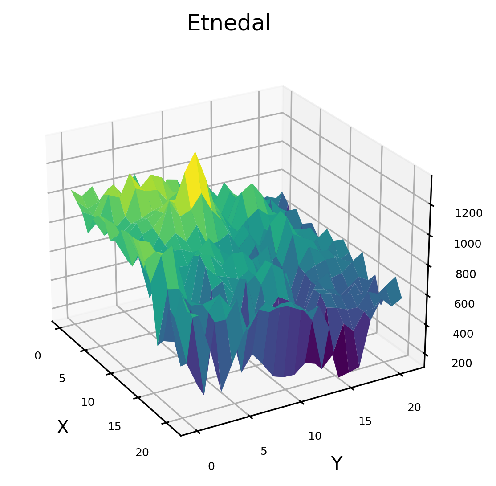
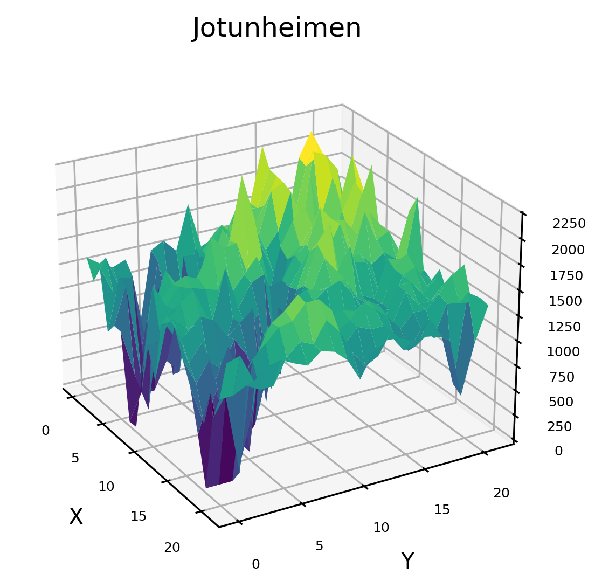
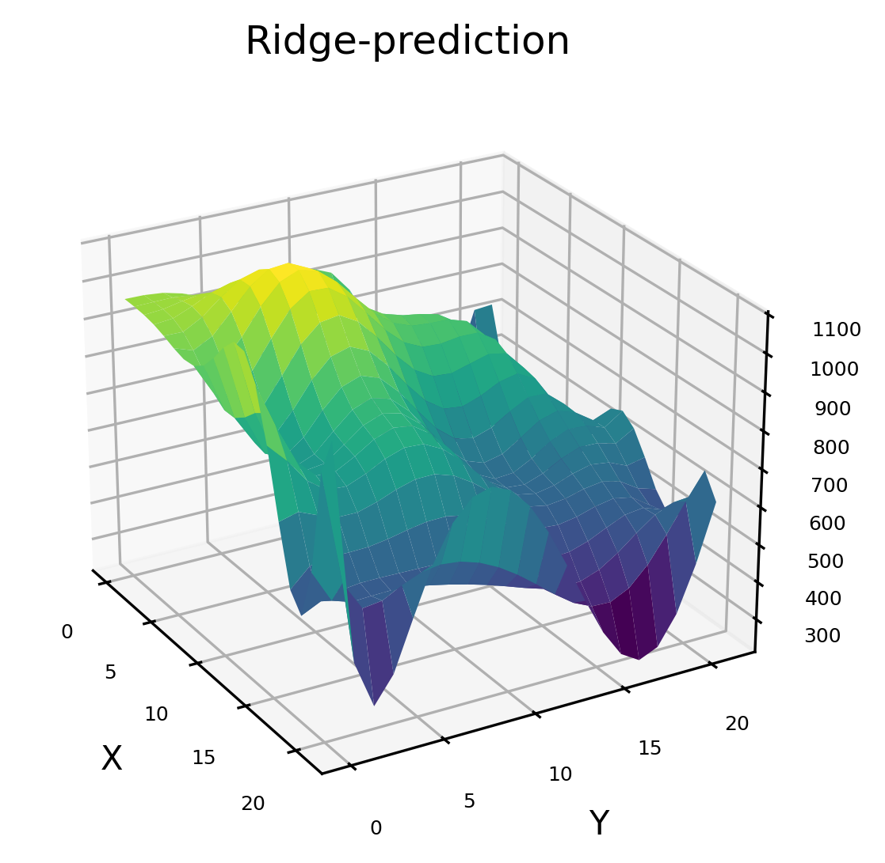
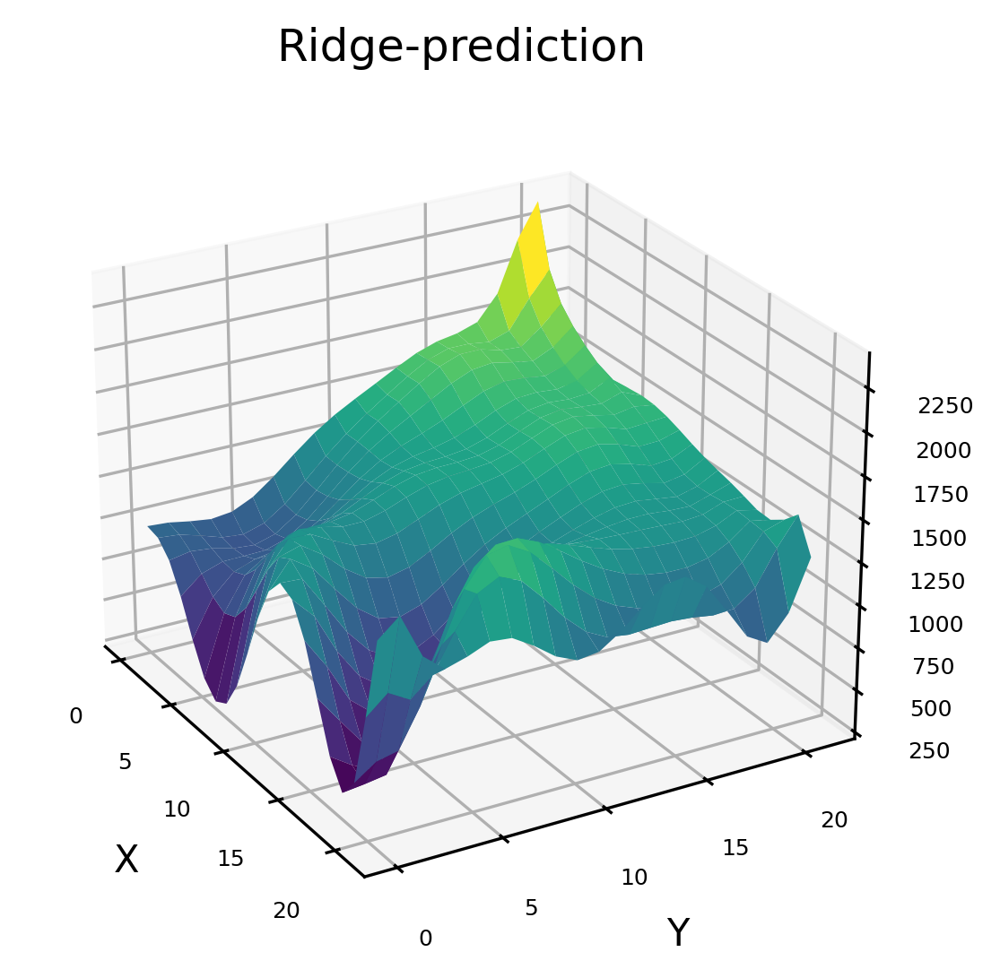
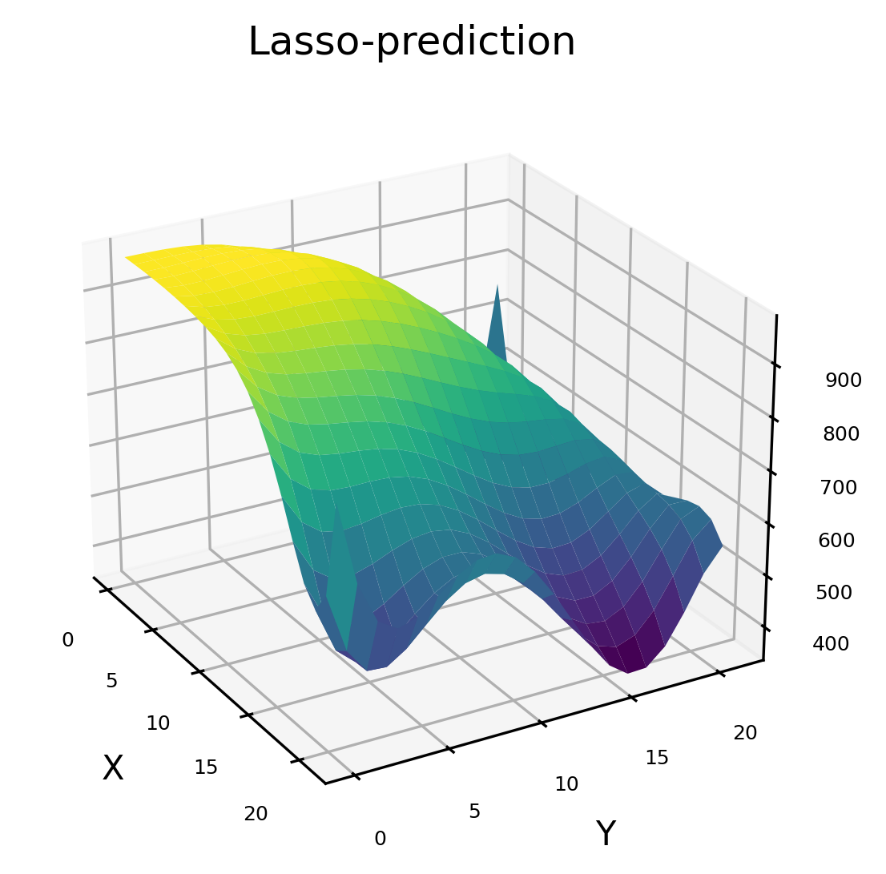
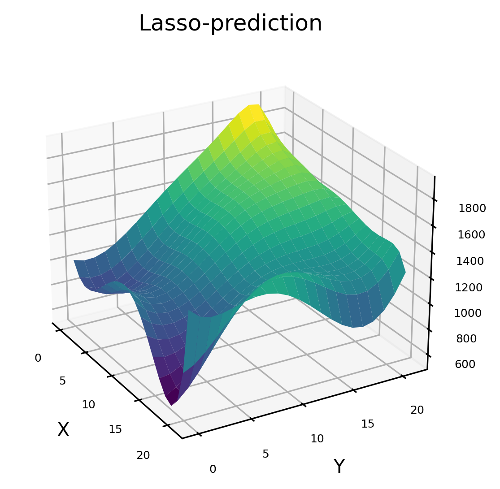

# Project 1 - Linear Regression
Repository for files and documentation for Project 1 in FYS-STK4155, which attempts to model the Franke-function and topographical data using the ordinary least square (OLS), Ridge, and Lasso regression methods.  
   
      
Details on the work can be found the the report saved in the folder "02-report"   
The programs are listed on the main page. The data to run the programs using the topographical data was to large to include here, but can be supplied upon request until I can upload downsampled versions of the files.   
The "02-data"-folder has a file showing some of the parameters that were found to give okay result.   
Additional results already produced can be found in the "04-figures"-folder. These can be regenerated using the programs
